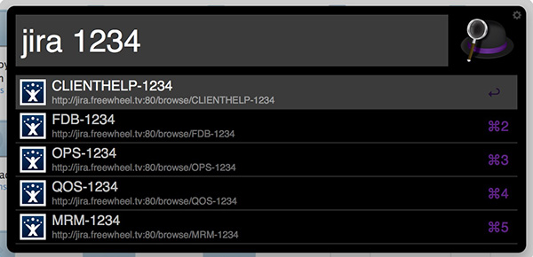
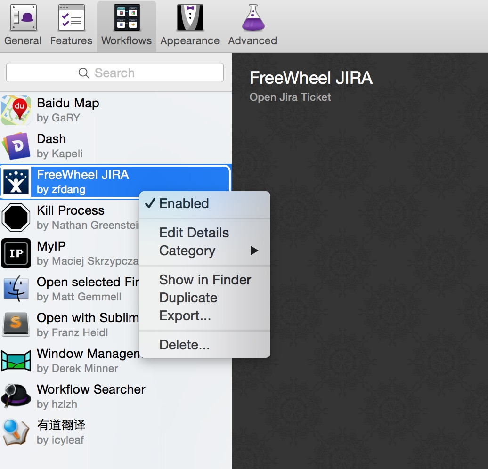

# Alfred JIRA Workflow Fork

this workflow allows you to open JIRA ticket by inputing ticket number directly

Alfred > jira 1234

All possible tickets will be shown, and you can select any of them and open it in default browser.

# Changes in Fork
1. Simplified projects' adding  (jira url as separate constant)
2. Removed projects' sorting (for prioritizing projects) 
3. Added possibility to insert full jira key (Alfred > jira TEST-8)

## Step.1 Install workflow to your Alfred

just double click file "FreeWheel JIRA.alfredworkflow" to install it 

## Step.2 Configure workflow to point to your JIRA system

Alfred --> Prefereces --> Workflow --> FreeWheel JIRA

--> Select "Show in Finder" in Right-click Menu

EDIT JIRA_URL in jira.py file:

> JIRA_URL = "http://jira-old.freewheel.tv/browse/"

Edit PROJECTS in jira.py file:

> PROJECTS = ["CLIENTHELP", "MRM", "FDB", "QOS",
>             "INK", "OPP", "ESC", "OPS"]

Save it.

## Step.3 Open JIRA ticket in Alfred with keyword "jira"

done.

